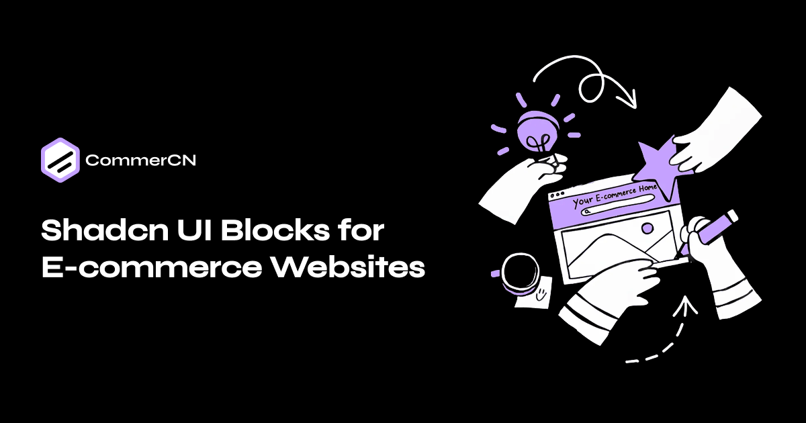

# CommerCN

A collection of pre-built ShadCN UI blocks specifically designed for e-commerce websites. Built with Next.js, TypeScript, and Tailwind CSS.




## Features

- 🎨 Pre-built UI components using ShadCN UI
- 📱 Fully responsive design
- 🛒 E-commerce focused blocks
- ⚡ Built with Next.js 16 and React 19
- 🎯 TypeScript support
- 🎪 Motion animations
- 📚 Documentation powered by Fumadocs

## Tech Stack

- **Framework**: Next.js 16
- **Language**: TypeScript
- **Styling**: Tailwind CSS 4
- **UI Components**: ShadCN UI
- **Icons**: Lucide React
- **Animations**: Motion
- **Documentation**: Fumadocs

## Getting Started

### Installation

```bash
npm install
```

### Development

```bash
npm run dev
```

Open [http://localhost:3000](http://localhost:3000) in your browser.

### Build

```bash
npm run build
```

### Linting

```bash
# Check code quality
npm run lint

# Format code
npm run format

# Build registry
npm run registry:build
```

## License

MIT
